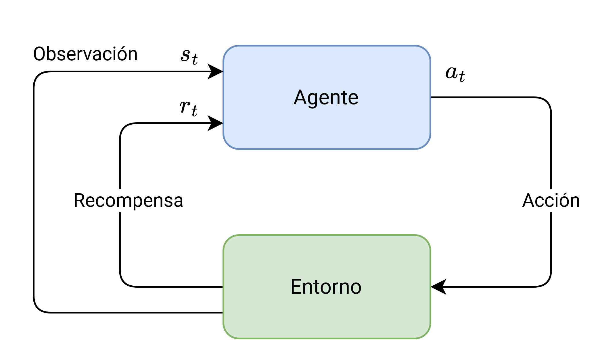
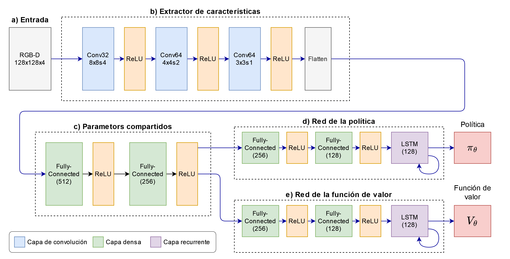

```{r setup, include=FALSE}
knitr::opts_chunk$set(echo = FALSE)
```

# Introducción

## Motivación {.flexbox .vcenter}

<div class="columns-2">
  <video width="100%" autoplay loop>
  <source src="videos/alphazero_2017_final.m4v" type="video/mp4"/>
  </video>
  <div align="center">
  Silver, David, et al. "Mastering the game of go without human knowledge." (2017).
  </div>
 
  <video width="100%" autoplay loop>
  <source src="videos/openai_five_dota_final.m4v" type="video/mp4"/>
  </video>
  <div align="center">
  Berner, Christopher, et al. "Dota 2 with large scale deep reinforcement learning." (2019).
  </div>
</div>

## Aprendizaje por refuerzo {.flexbox .vcenter}

<div align="center">
  
</div>


## DRL aplicado a la robótica {.flexbox .vcenter}

<div class="columns-2">
  <video width="100%" autoplay loop>
  <source src="videos/shadow_hand_real_block_final.m4v" type="video/mp4"/>
  </video>
  <div align="center">
  Andrychowicz, OpenAI: Marcin, et al. "Learning dexterous in-hand manipulation." (2020).
  </div>
 
  <video width="100%" autoplay loop>
  <source src="videos/shadow_rubik_normal.m4v" type="video/mp4"/>
  </video>
  <div align="center">
  Akkaya, Ilge, et al. "Solving rubik's cube with a robot hand." (2019).
  </div>
</div>


## Planteamiento del problema {.flexbox .vcenter}

<div class="columns-2">
  Algunas de las complicaciones de aplicar directamente DRL a robots reales son:<br><br>
  <ul>
  <li>Ineficiencia de muestreo</li>
  <li>Riesgo de seguridad</li>
  <li>Es difícil reiniciar el entorno</li>
  </ul>
 
  
</div>

## Aprendiendo en simulación {.flexbox .vcenter}

<div class="columns-2">
  <video width="100%" autoplay loop>
  <source src="videos/openai_rubik.m4v" type="video/mp4"/>
  </video>
 
  
</div>

## Tiempo de entrenamiento en DRL en simulación {.flexbox .vcenter}

<div align="center">
  
</div>

---

<div class="columns-2">
  "Learning dexterous in-hand manipulation" de OpenAI requirió de lo siguiente:
  
  - **Simulador**: MuJoCo
  - **Recursos (CPU)**: 6144 núcleos de CPU
  - **Recursos (GPU)**: 8 Nvidea V100 $\approx$ 896 teraFLOPS
  - **Entrenamiento**: 40 hrs
  - **Costo**: $ 7418.88 USD
 
  <video width="100%" autoplay loop>
  <source src="videos/shadow_hand_block.mp4" type="video/mp4"/>
  </video>
</div>


## Estado del arte {.flexbox .vcenter}

| Simulador | Física | Fotorrealista | DR  | ROS | GPU | Multi-GPU |
|-----------|:------:|:-------------:|:---:|:---:|:---:|:---------:|
| Gazebo	|   ✅   |  	❌   	| ❌  | ✅  | ✅  |	❌ 	|
| Pybullet  |   ✅   |  	❌   	| ❌  | ❌  | ✅  |	❌ 	|
| MuJoCo	|   ✅   |  	❌   	| ❌  | ❌  | ❌  |	❌ 	|
| Unity 	|   ❌   |  	✅   	| ❌  | ❌  | ✅  |	❌ 	|
| IsaacSim  |   ✅   |  	✅   	| ✅  | ✅  | ✅  |	✅ 	|

## Isaac Gym {.flexbox .vcenter}

<div class="columns-2">
  <video width="100%" autoplay loop>
  <source src="videos/isaac-gym-demo-01.m4v" type="video/mp4"/>
  </video>
  <video width="100%" autoplay loop>
  <source src="videos/isaac-gym-demo-03.m4v" type="video/mp4"/>
  </video>

  
</div>

## Hipótesis {.flexbox .vcenter}

"Es posible generar una política de control optimizada para la solución de una tarea de seguimiento de trayectorias sobre superficies tridimensionales usando un robot manipulador, mediante un ambiente de simulación física realista que provea las observaciones necesarias para el entrenamiento, empleando una combinación de técnicas de control tradicionales y algoritmos de DRL de forma eficiente, reduciendo el número de interacciones del agente y los recursos computacionales durante el entrenamiento"

## Objetivos {.flexbox .vcenter}

- Realizar una comparación entre los simuladores robóticos y un estudio de compatibilidad con los frameworks de ML.
- Proponer una arquitectura experimental que permita generar las observaciones necesarias para el entrenamiento de un agente que permita resolver la tarea asignada.
- Hacer una comparación del rendimiento de entrenamiento, utilizando la metodología propuesta, variando los parámetros de simulación para la tarea propuesta.

## Contribución del proyecto {.flexbox .vcenter}

1. Desarrollo de una metodología de entrenamiento de modelos de DRL para resolver tareas de seguimiento de trayectorias en superficies tridimensionales de forma end-to-end.
2. Una política capaz de inferir de la fuerza aplicada a los motores a partir de solo las imágenes de un sensor RGBD ubicado en el efector final del robot.
4. Proposición de una arquitectura de entrenamiento que implementa un simulador robótico de vanguardia y un framework de DL de alto rendimiento de manera eficiente.
5. Reducción del tiempo y los recursos computacionales requeridos para el entrenamiento de modelos de DRL.

## Aplicaciones {.flexbox .vcenter}

<div class="columns-2">
  Aplicación directa de las políticas a la automatización de procesos industriales con robots:<br><br>
  <ul>
  <li>Soldadura</li>
  <li>Pintura</li>
  <li>Aplicación de aditivos</li>
  <li>Manufactura aditiva</li>
  </ul>
 
  
  
</div>


# Metodología

## Arquitectura del sistema de aprendizaje {.flexbox .vcenter}

<div align="center">
  
</div>

## Generador de datos sintéticos de entrenamiento {.flexbox .vcenter}

<div class="columns-2">
$$
\mathbf{C}(u) = \sum_{i=0}^{i<n} N_{i,p}(u) \mathbf{P}_{i}
$$

$$
\begin{split}
N_{i, p}(u) = \frac{u-u_{i}}{u_{i+p}-u_{i}} N_{i,p-1}(u) + \cdots \\  \frac{u_{i+p+1}-u}{u_{i+p+1}-u_{i+1}} N_{i+1, p-1}(u)
\end{split}
$$

$$
N_{i, 0}(u)=\left\{\begin{array}{cc}
        1 & \text { si } u_{i} \leq u<u_{i+1} \\
        0 & \text { si no }
    \end{array}\right.
$$


</div>

## Mapeo de la trayectoria 2D a 3D

<div class="columns-2">
$$
\begin{align*} 
\textbf{p}_{uv} &= -\begin{bmatrix}
        2 \pi s + \pi \\
        \pi t + \frac{\pi}{2}
    \end{bmatrix} \\\\
\textbf{p}_{xyz} &= r \begin{bmatrix} 
        \cos{(v)} \cos{(u)} \\
        \cos{(v)} \sin{(u)} \\
        \sin{(v)}
    \end{bmatrix} \\\\
\textbf{n} &= \begin{bmatrix} \sin{(u)} \cos{(v)} \\ \sin{(v)} \sin{(u)} \\ \cos{(u)} \end{bmatrix}
\end{align*}
$$


</div>


## Observacion {.flexbox .vcenter}

TODO

## Espacio de accion

$$
\textbf{u}_{d} = \textbf{J}_{ee}^{T}(\textbf{q}) \textbf{M}_{\textbf{x}_{ee}}(\textbf{q}) [k_{p}(\textbf{x}_{d} - \textbf{x}) + k_v(\dot{\textbf{x}}_{d} - \dot{\textbf{x}})] + \textbf{g}(\textbf{q})
$$

## Señal de recompensa

$$
\begin{align*}
r_{d} &= -{\lVert \textbf{x}_{ee} - \textbf{x}_d \lVert}_2 \\\\
r_{r} &= -{\lVert \mathcal{H}(\textbf{q}_d, \textbf{q}^{*}_{ee}) \lVert}_2 \\\\
r_{c} &= -{\lVert \textbf{a} \lVert}^{2}_2 \\
R &= \begin{bmatrix}\alpha && \beta && \gamma\end{bmatrix}
        \begin{bmatrix}r_d \\ r_o \\ r_c\end{bmatrix}
\end{align*}
$$

## Algoritmo de entrenamiento {.flexbox .vcenter}

TODO

## Arquitectura de red neuronal {.flexbox .vcenter}
 
<div align="center">
  
</div>

# Resultados

## Desempeño de la política {.flexbox .vcenter}

<div align="center">
  
</div>

## Resultados de entrenamiento {.flexbox .vcenter}

<div align="center">
  
</div>

## Demo {.flexbox .vcenter}

<div align="center">
  <video width="75%" autoplay loop>
  <source src="videos/best-policy-demo-full.m4v" type="video/mp4">
  </video>
</div>

# Conclusiones y trabajo futuro

## Conclusiones {.flexbox .vcenter}

- Este trabajo propone metodología para resolver el problema de seguimiento de trayectoria en superficies tridimensionales de forma end-to-end, mediante una combinación de algoritmos de DRL y técnicas de control tradicionales.
- La política generada tiene una tasa de éxito del **96%** y un error en la posición de **$\pm$ 0.01** metros.
- Se logró reducir en **30%** el tiempo de entrenamiento mediante la paralelización de 512 ambientes en una sola GPU Nvidia 3070.
- Este trabajo es pionero en resolver tareas de manipulación guiadas con visión en la plataforma de investigación de RL de Isaac Gym y podría habilitar el desarrollo de trabajos futuros en el área de DRL y visión por computadora.

## Trabajo futuro {.flexbox .vcenter}

- Ampliar el estudio a otros agentes manipuladores y el desarrollo de políticas de control generalizadas.
- Transferir la política aprendida en simulación a agentes reales (i.e., sim2real) mediante el uso de técnicas de Domain Randomization.
- Ampliar el alcance de la tarea a cualquier objeto 3D arbitrario.